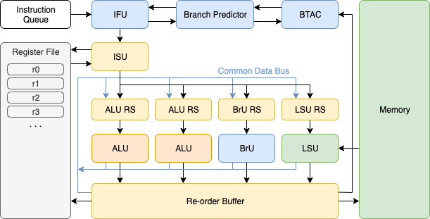

# superscalar-processor

A simulation of a Superscalar Processor



## Usage

This project is written in Java and built using Apache Ant.

- Check Apache Ant is installed:
  ```
  $ ant -version
  Apache Ant(TM) version 1.10.6 compiled on May 2 2019
  ```
  If not, follow [these instructions](http://ant.apache.org/manual/install.html), or install with your package manager.
- The `$ ant all` command (or simply `$ ant`) will build and run the project. For fine-grained interaction,
  - `$ ant clean` cleans the build directory,
  - `$ ant build` compiles the source tree files,
  - `$ ant build-jar` compiles a JAR from built class files,
  - `$ ant run` runs the project JAR, with the option to specify a custom program file: `$ ant run -Dpf=./programs/some_program.asm`.
- Alternatively, once built, you can interact with the JAR directly:
  - `$ java -jar superscalar-processor.jar` to run the default program, or
  - `$ java -jar superscalar-processor.jar ./programs/some_program.asm` to specify a custom program file.


## Built with

- [Java](http://www.java.com/) - Project language
- [Apache Ant](https://ant.apache.org/) - Automates the project build process

## License

[MIT license](./LICENSE)